

# CONFIGURACIÓN Y DESARROLLO DE APLICACIONES EN RED

# Trabajo práctico especial

**Grupo Número 6**

**Ayudante designado: [Germán Imeroni](mailto:gimeroni@alumnos.exa.unicen.edu.ar)**

**Integrantes**

**[Palazzo Ulises](mailto:ulipalazzoo@gmail.com)**  
**[Rago Juan Ignacio](mailto:juanrago2015@gmail.com)**  
**[Kain Sol](mailto:kain.sol01@gmail.com)**  
**[Weber Martiniano](mailto:martinianoweber@gmail.com)**  

24/05/2023

# PARTE UNO

## Índice

- [EJERCICIO 1.A](#a-desglose-los-requerimientos-completando-la-siguiente-tabla-para-cada-una-de-las-fábricas-obteniendo-como-resultado-el-requerimiento-total-para-cada-una)
- [EJERCICIO 1.B](#b-considerando-los-requerimientos-finales-de-las-fábricas-y-el-resto-de-los-datos-de-la-infraestructura-del-parque-industrial-desglose-los-requerimientos-asociados-a-la-configuración-de-las-subredes-completando-la-siguiente-tabla)
- [EJERCICIO 1.C](#c-aplique-la-técnica-vlsm-para-el-parque-industrial-en-general-justifique)
- [EJERCICIO 1.D](#d-aplique-la-técnica-vlsm-para-cada-una-de-las-fábricas-justifique)
    - [Fabrica A](#fábrica-a)
    - [Fabrica B](#fábrica-b)
- [EJERCICIO 1.E](#e-cree-una-tabla-donde-se-observen-los-siguientes-datos-de-cada-red-obtenida-de-la-aplicación-de-la-técnica-de-vlsm-dirección-base-la-máscara-el-rango-de-ip-asignables-y-dirección-broadcast)
- [EJERCICIO 1.F](#f-implemente-la-topología-del-gráfico-1-en-core-con-las-redes-obtenidas-en-los-puntos-anteriores)
- [EJERCICIO 1.G](#g-configure-las-interfaces-de-los-router-colocando-su-ip-y-máscara)
- [EJERCICIO 1.H](#h-compruebe-el-funcionamiento-interno-de-cada-red-y-la-asignación-de-ips-utilizando-los-comandos-ping-traceroute-y-la-aplicación-wireshark-adjunte-capturas-y-explique-lo-que-comprueba-en-cada-caso)
    - [Fabrica B - Ping](#fábrica-b---ping)
    - [Fabrica B - Traceroute](#fábrica-b---traceroute)
    - [Fabrica A - Ping](#fábrica-a---ping)
    - [Fabrica A - Traceroute](#fábrica-a---traceroute)
    - [Datacenter - Ping y Traceroute](#datacenter---ping-y-traceroute)
    - [Red Troncal - Ping](#red-troncal---ping)
    - [Red Troncal - Traceroute](#red-troncal---traceroute)
    - [Red Publica - Ping y Traceroute](#red-pública---ping-y-traceroute)

# EJERCICIO 1 

### a) Desglose los requerimientos completando la siguiente tabla para cada una de las fábricas, obteniendo como resultado el requerimiento total para cada una.

|NOMBRE DE RED|DESCRIPCIÓN DE LAS IPS NECESARIAS|TAMAÑO DEL BLOQUE ASIGNADO|MÁSCARA RESULTANTE|
| - | - | - | - |
|Datacenter|500 servers   3 interfaz   2 base + broadcast|512|255.255.254.0|
|Red troncal|300 fábricas   2 interfaz   2 base + broadcast   |512|255.255.254.0|
|Fábrica A|Total de IP requeridas 154|246|255.255.255.0|
|Fabrica B|Total de IP requeridas 114|246|255.255.255.0|

### b) Considerando los requerimientos finales de las fábricas y el resto de los datos de la infraestructura del parque industrial, desglose los requerimientos asociados a la configuración de las subredes completando la siguiente tabla.

|NOMBRE DE RED|DESCRIPCIÓN DE LAS IPS NECESARIAS|TAMAÑO DEL BLOQUE ASIGNADO|MÁSCARA RESULTANTE|
| - | - | - | - |
|SW3|45 Dispositivos max   1 interfaz   2 base + broadcast   |64|255.255.255.192|
|R7|80 host max   1 interfaz   2 base + broadcast   |128|255.255.255.128|
|SW4|16 host max   1 interfaz   2 base + broadcast   |32|255.255.255.224|
|R6-R7|2 Interfaz   2 base+ broadcast   |4|255.255.255.252|
|HUB|8 host max   1 interfaz   2 base + broadcast   |16|255.255.255.240|
|SW5|65 host max   1 interfaz   2 base + broadcast   |128|255.255.255.128|
|SW6|32 host max   1 interfaz   2 base + broadcast   |64|255.255.255.192|

En la Fábrica B, el máximo de HOST asignables en total es 114, por lo cual a simple vista, con una máscara de /25 alcanza para el total de redes asignables (128), pero al tener una subred que requiere 68 IPs (SW5) nos fuerza a asignarle un rango de IP con máscara /25, por lo cual el rango de IP asignables para la red de la Fábrica B termina siendo /24 con 256 direcciones asignables.

### c) Aplique la técnica VLSM para el Parque Industrial en general (Justifique).

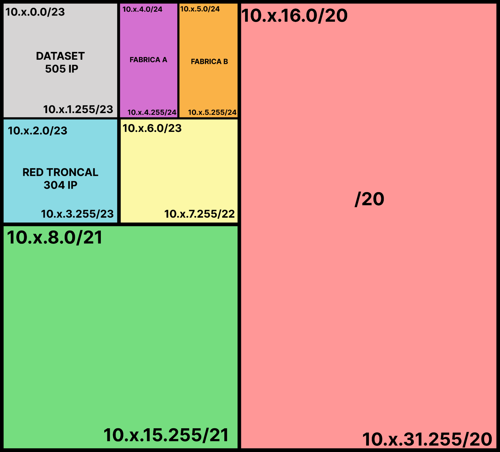

Se designa una red con capacidad para 512 IP para el **Datacenter**, abarcando la totalidad de IP solicitadas para cada servidor que integra dicha red, para la **Red Troncal** se designa una red de igual capacidad, debido a que cada router que conforme la red de cada fábrica va a necesitar una IP para su interfaz, lo que suma un total de 300 IP mas base, broadcast y las IP de los routers frontera con el Datacenter son 304 IP necesarias, luego una red /24 para cada fábrica correspondiente a las necesidades calculadas más abajo en el desarrollo del TP.

### d) Aplique la técnica VLSM para cada una de las fábricas (Justifique).

# Fábrica A

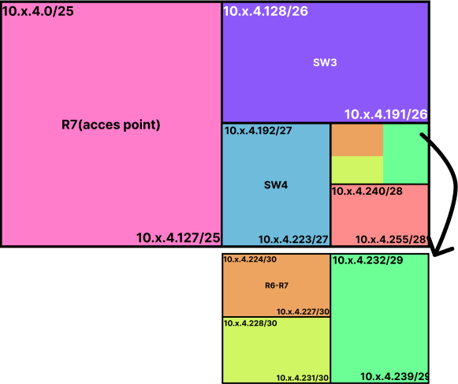

# Fábrica B

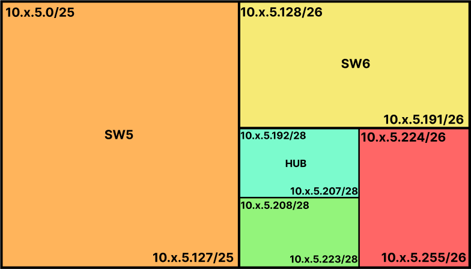

### e) Cree una tabla donde se observen los siguientes datos de cada red obtenida de la aplicación de la técnica de VLSM: dirección base, la máscara, el rango de ip asignables y dirección broadcast.

|NOMBRE DE RED|DIRECCIÓN BASE|MÁSCARA|RANGO ASIGNABLE|BROADCAST|
| - | - | - | - | - |
|Datacenter|10.6.0.0|255.255.254.0|10.6.0.1 -   10.6.1.254   |10.6.1.255|
|Red troncal|10.6.2.0|255.255.254.0|10.6.2.1 -   10.6.3.254   |10.6.3.255|
|R7|10.6.4.0|255.255.254.128|10.6.4.1 -   10.6.4.126   |10.6.4.127|
|SW3|10.6.4.128|255.255.255.192|10.6.4.129 -   10.6.4.190   |10.6.4.191|
|SW4|10.6.4.192|255.255.255.224|10.6.4.193 -   10.6.4.222   |10.6.4.223|
|R6-R7|10.6.4.224|255.255.255.252|10.6.4.225 -   10.6.4.226   |10.6.4.227|
|SW5|10.6.5.0|255.255.254.128|10.6.5.1 -   10.6.5.126   |10.6.5.127|
|SW6|10.6.5.128|255.255.255.192|10.6.5.129 -   10.6.5.190   |10.6.5.191|
|HUB|10.6.5.192|255.255.255.240|10.6.5.193 -   10.6.5.206   |10.6.5.207|

### f) Implemente la topología del gráfico 1 en CORE, con las redes obtenidas en los puntos anteriores.

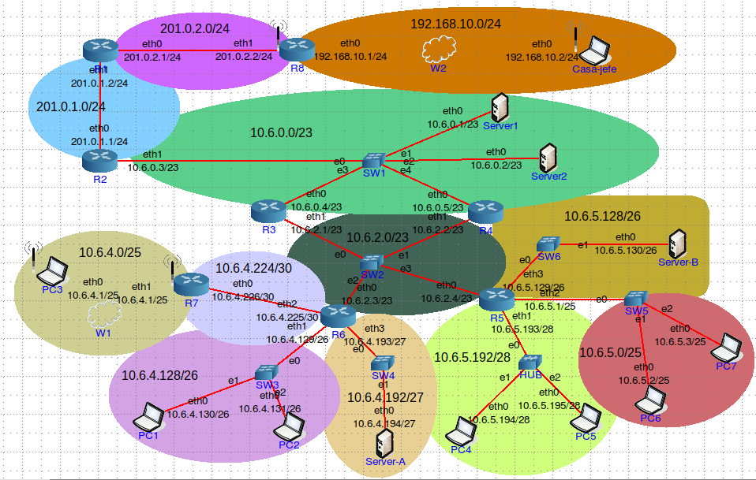

### g) Configure las interfaces de los router colocando su IP y Máscara.

Los routers fueron configurados tanto de forma visual, como de forma interna, mediante comandos definidos en “UserDefined”

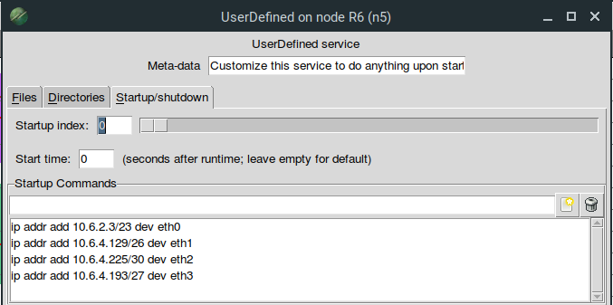

### h) Compruebe el funcionamiento interno de cada red y la asignación de IPs utilizando los comandos ping, traceroute y la aplicación wireshark. Adjunte capturas y explique lo que comprueba en cada caso.  

### Fábrica B - Ping

Comprobamos el comportamiento de todas las subredes pertenecientes a la fábrica B, con el comando ping, podemos observar que los paquetes llegan a destino dado que enviamos paquetes a dispositivos pertenecientes a subredes directas del mismo router.

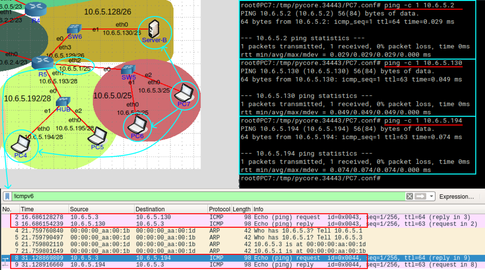

### Fábrica B - Traceroute

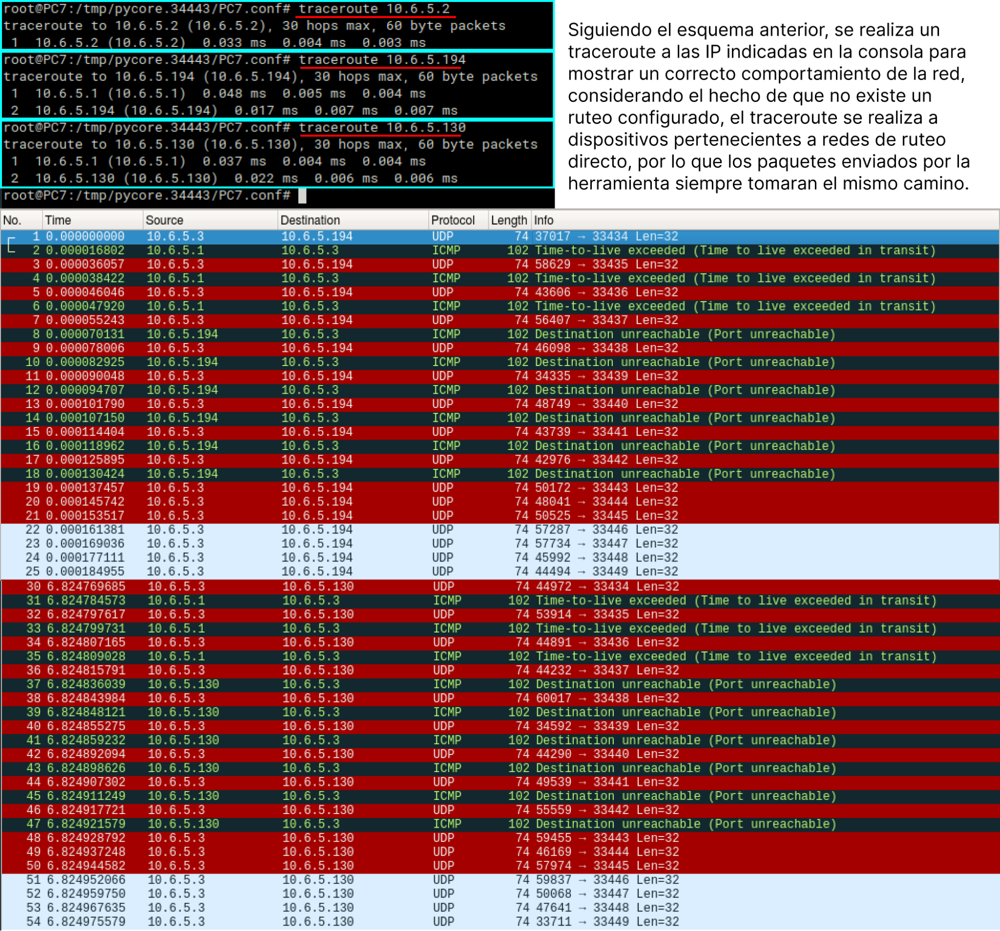

A partir de este análisis, las diferentes subredes se testean de igual manera, durante el proceso se arreglan diferentes comportamientos extraños en la red debidos a pequeños errores en la asignación de las IP, o del rango de la nubecita del wifi.

El **Tracroute** envía frames ICMP con ttl creciente, iniciando con un ttl=1, luego ttl=2 y así hasta un límite que puede ser especificado en el mismo comando, o hasta que el frame llegue a destino, los distintos routers informan cuando se agota el ttl de un frame con un error “Time to live exceeded” y la ip de origen del error, formando así un camino.

### Fábrica A - Ping

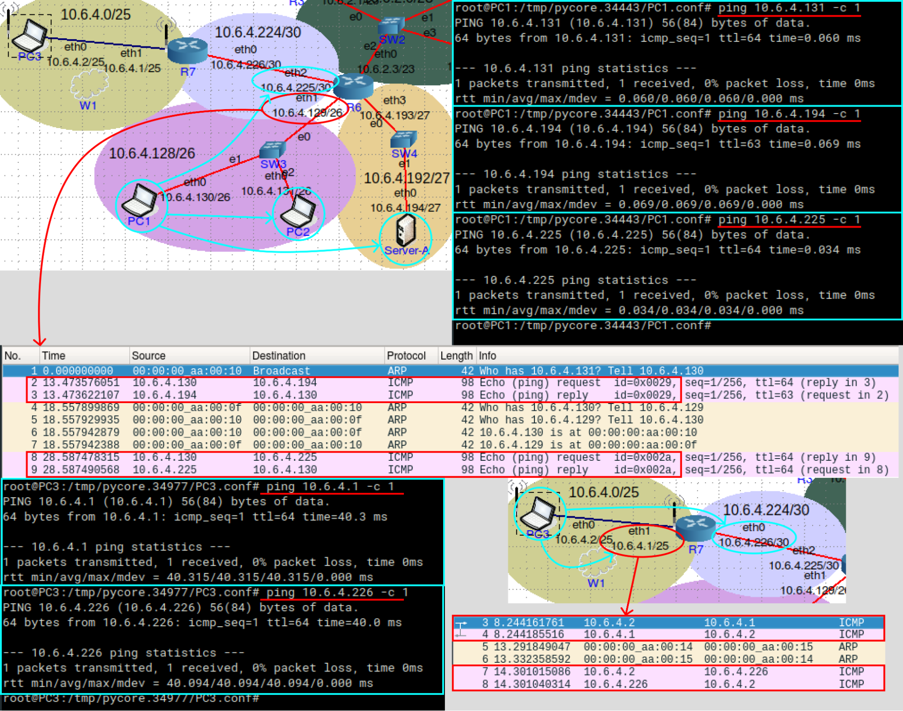

Se observa un comportamiento correcto de la red, ya que los paquetes enviados llegan a destino y en traceroute se observa que el camino de los paquetes es el adecuado.

### Fábrica A - Traceroute

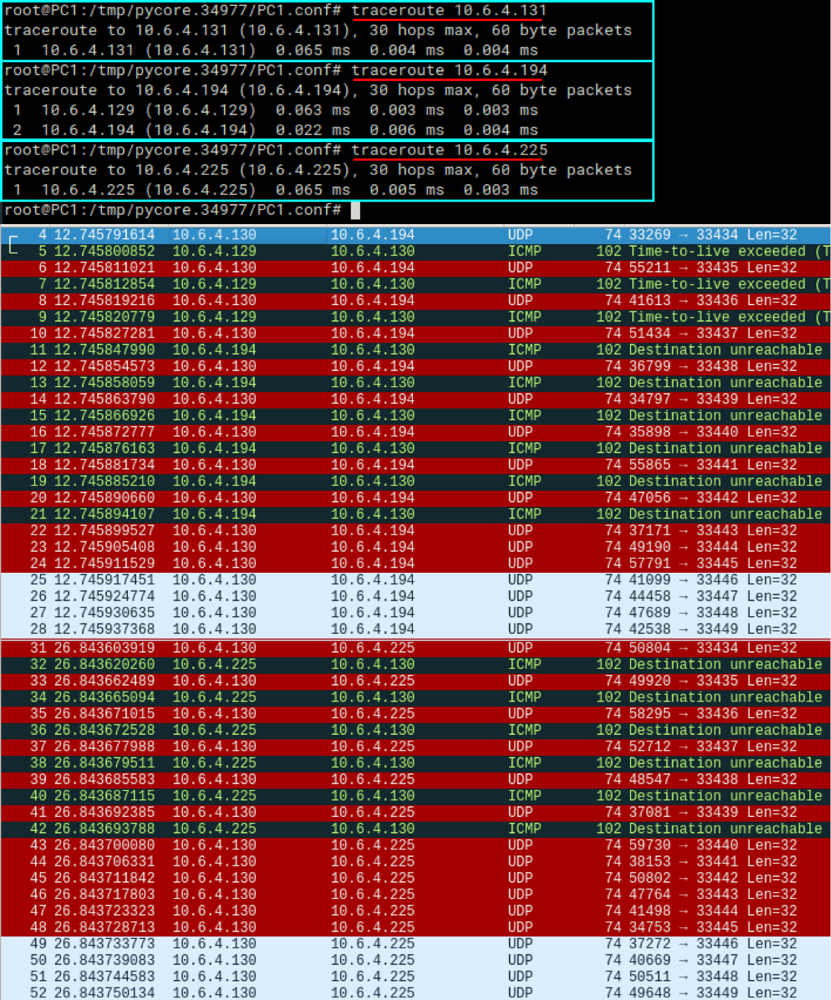

### Datacenter - Ping y Traceroute

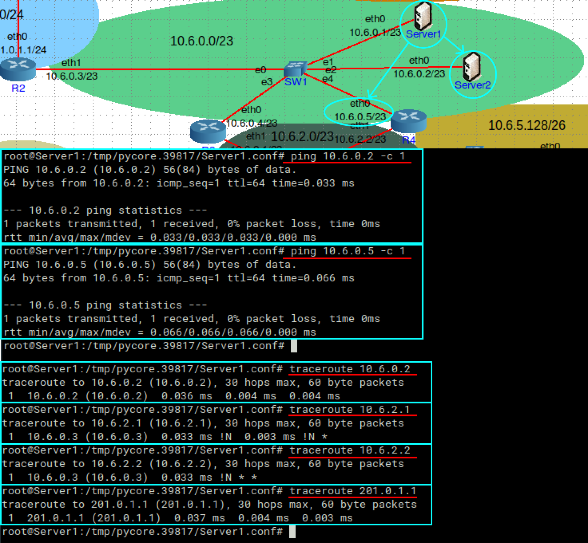

Con Traceroute se comprueba la interfaz de los routers que no pertenecen a la misma red y con esto podemos determinar que al no haber un ruteo establecido, todos los paquetes son enviados por la eth1 del R2.

### Red Troncal - Ping

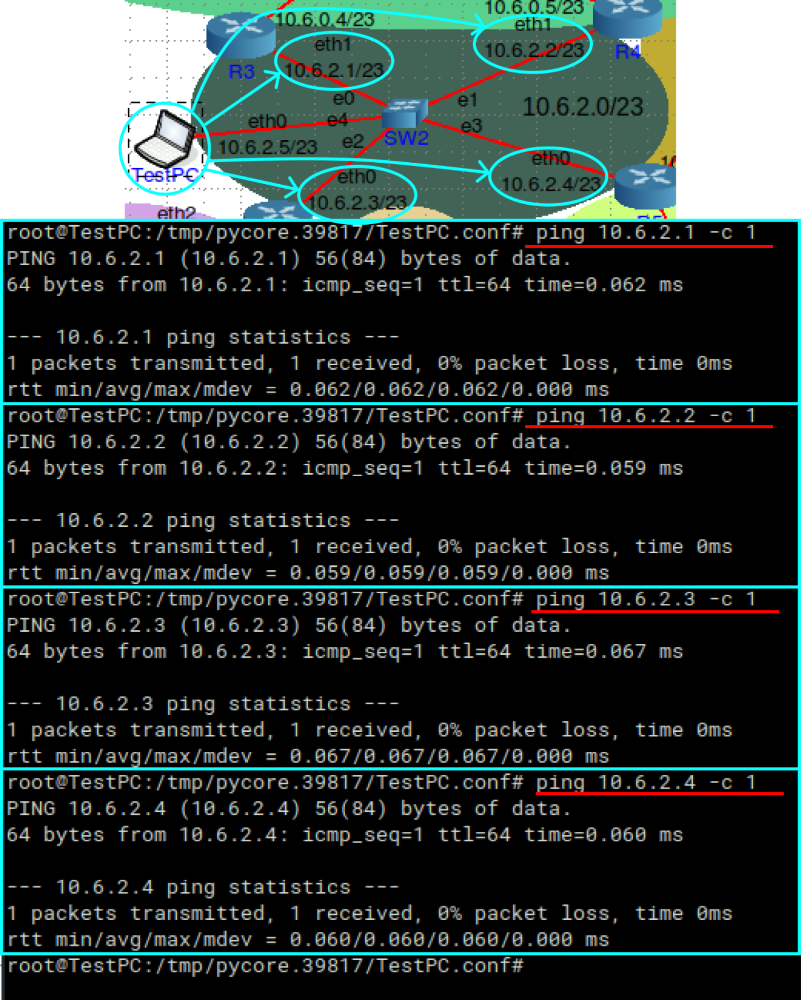

### Red Troncal - Traceroute

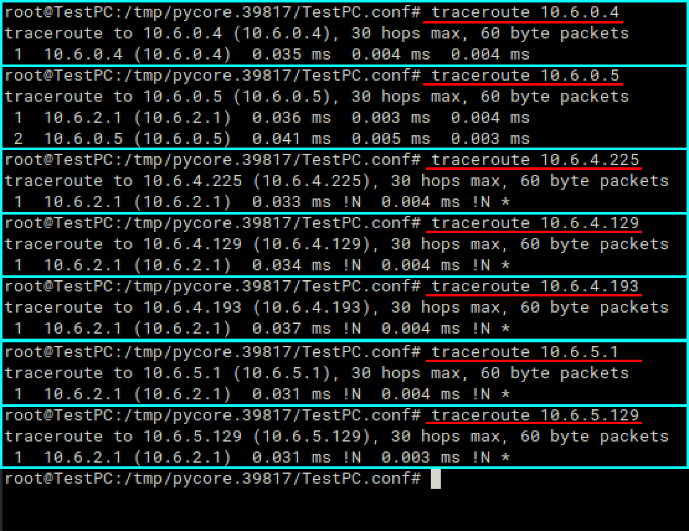

Para esta red se decide colocar una PC de testeo para poder analizarla, lo consideramos adecuado, ya que no existe un Host en esta red y si bien el análisis se podría haber realizado desde los mismos routers, con una PC queda más agradable a la vista.

Nuevamente, se observa un comportamiento normal de la red, comprobamos las interfaces de los routers que no pertenecen a la misma red y como en el caso anterior, se envían los paquetes por la **e0** del switch debido a que no existe un ruteo configurado.

### Red Pública - Ping y Traceroute

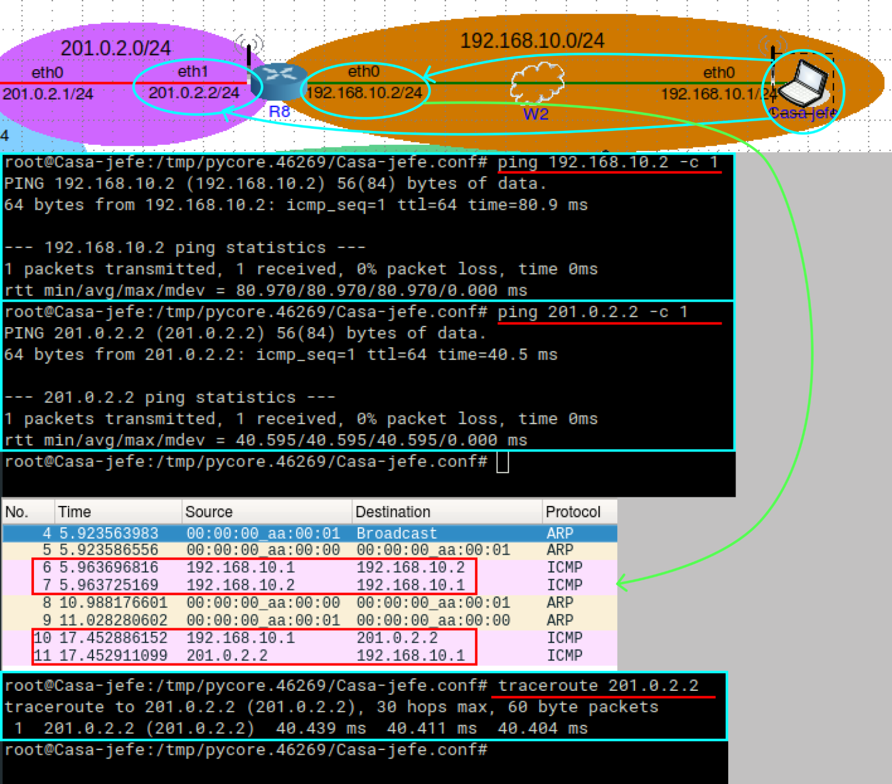

En esta red se soluciona un error inesperado, por el hecho de que no sabíamos que la nubecita del wifi tiene un rango, solucionando ese problema, la red funciona correctamente.

# PARTE DOS
# EJERCICIO 2 .a)
Escribe aquí tu texto Escribe aquí tu texto Escribe aquí tu texto Escribe aquí tu texto Escribe aquí tu texto Escribe aquí tu texto Escribe aquí tu texto Escribe aquí tu texto

|<h2>RED DESTINO</h2>|<h2>SIGUIENTE ROUTER</h2>|<h2>INTERFAZ</h2>|<h2>DIRECTA/INDIRECTA</h2>|
| :-: | :-: | :-: | :-: |
|Escribe aquí tu texto||||
|Escribe aquí tu texto||||
|Escribe aquí tu texto||||
#
# EJERCICIO 2 .b)
Escribe aquí tu texto Escribe aquí tu texto Escribe aquí tu texto Escribe aquí tu texto Escribe aquí tu texto Escribe aquí tu texto Escribe aquí tu texto Escribe aquí tu texto
# EJERCICIO 2 .c)
Escribe aquí tu texto Escribe aquí tu texto Escribe aquí tu texto Escribe aquí tu texto Escribe aquí tu texto Escribe aquí tu texto Escribe aquí tu texto Escribe aquí tu texto
# EJERCICIO 2 .d)
Escribe aquí tu texto Escribe aquí tu texto Escribe aquí tu texto Escribe aquí tu texto Escribe aquí tu texto Escribe aquí tu texto Escribe aquí tu texto Escribe aquí tu texto
# EJERCICIO 2 .e)
Escribe aquí tu texto Escribe aquí tu texto Escribe aquí tu texto Escribe aquí tu texto Escribe aquí tu texto Escribe aquí tu texto Escribe aquí tu texto Escribe aquí tu texto
# CONCLUSIÓN PARTE DOS
Escribe aquí tu texto Escribe aquí tu texto Escribe aquí tu texto Escribe aquí tu texto Escribe aquí tu texto Escribe aquí tu texto Escribe aquí tu texto Escribe aquí tu texto Escribe aquí tu texto Escribe aquí tu texto Escribe aquí tu texto Escribe aquí tu texto Escribe aquí tu texto Escribe aquí tu texto.

#### 18  
